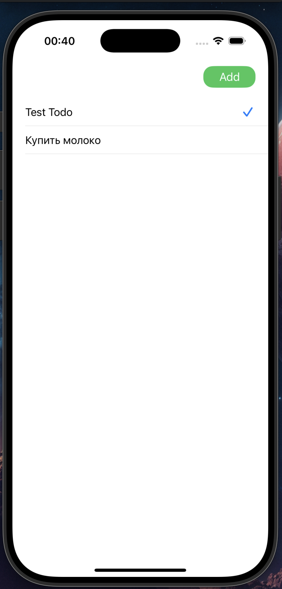

Простой TodoList
**Основная цель:** Научится писать приложения с помощью **UIKit** без использования `storyboard`

При запуске приложения по центру нас встречает таблица, в правом верхнем углу располагается кнопка добавления задачи. 

При добавлении задачи пользователю даётся возможность ввести цель задачи и её описание. 

После добавления задачи она появляется в таблице. Для удаления элемента используется свайп влево. Для пометки выполнена задача или нет достаточно просто нажать на неё

  

# Будущие доработки
Требуется добавить возможность просматривать описание задачи, и изменять её по мере необходимости. Из-за этого скорее всего придётся по другому реализовать пометку выполнения задачи. Так же можно добавить дедлайн для выполнения задачи
